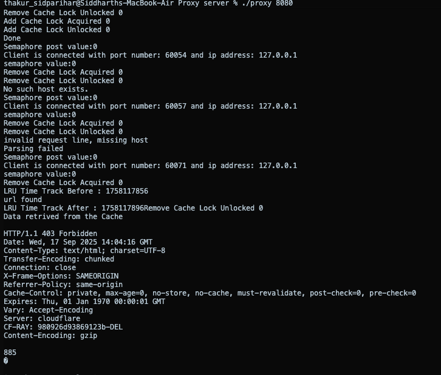
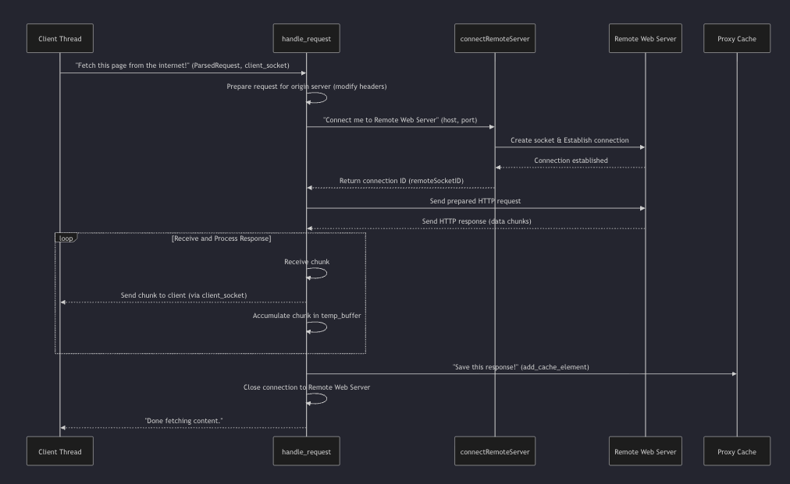

# HTTP Proxy Server with LRU Caching

## Project Overview

This project is a multi-threaded HTTP Proxy Server written in C. It efficiently handles multiple client connections concurrently, forwards HTTP GET requests to remote web servers, and caches frequently requested responses in memory using a Least Recently Used (LRU) cache strategy.

It improves performance by serving repeated requests from cache and ensures thread safety using mutexes and semaphores.

## Features

- Multi-threaded design using POSIX threads (pthread)
- Handles up to 400 concurrent client connections
- Limits concurrent connections using semaphores
- Parses and forwards HTTP GET requests
- In-memory caching of HTTP responses using an LRU eviction policy
- Thread-safe cache access using mutex locks
- Supports common HTTP error responses (400, 403, 404, 500, 501, 505)
- Dynamic memory management for handling large responses
- Configurable listening port at runtime

## How It Works

When a client sends an HTTP GET request to the proxy server:

1. The proxy checks if the requested URL is in the cache.
   - If the cache has the URL, the cached response is sent back to the client.
   - If the URL is not cached:
     - The proxy parses the HTTP request.
     - It connects to the remote server using sockets.
     - Forwards the modified request.
     - Receives the response and sends it back to the client.
     - Stores the response in the cache.

The cache follows the Least Recently Used (LRU) strategy. If the cache exceeds the maximum allowed size (200 MB), the least recently used elements are removed to make space for new entries.

## Technology Stack

- C programming language
- POSIX Threads (pthread) for multithreading
- Semaphores for limiting concurrent connections
- Sockets for network communication
- Mutex locks for synchronizing cache access
- Time functions for LRU tracking

## Usage Instructions

1. Compile the project:

    ```
    make
    ```

2. Run the proxy server by specifying a port number:

    ```
    ./proxy 8080
    ```

3. Configure your browser or HTTP client (like Postman) to use `localhost:8080` as the proxy server.

## Example Error Response


## Sequence Diagram
